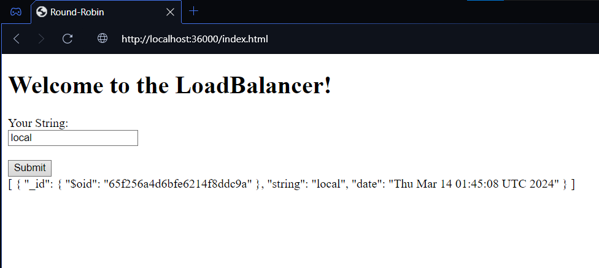

# PRIMER DESPLIEGUE EN LA NUBE - AWS (TALLER 6 AREP)

Taller 6 del curso de Arquitecturas Empresariales (AREP) en el cual se maneja un balanceador de cargas que administra el tráfico hacia 3 instancias de servidores que registran logs en una misma base de datos Mongo DB. Toda la solución esta Dockerizada y desplegada en un ambiente de nube, especificamente en una máquina AWS EC2.

## Diseño
Este proyecto cuenta con 3 componentes principales

1. `Round-Robin-Service` Componente que se encarga de administrar las cargas de trabajo (Tráfico de red con peticiones) entre las instancias de servidores de logs. Esto lo hace utilizando el algoritmo Round-Robin el cual delega de manera eficiente las cargas de trabajo entre instancias en una red. Además, cuenta con un servicio Frontend desde el cual los clientes generan peticiones para almacenar cadenas en una base de datos.
2. `Log-Service` Componente que se encarga de recibir una cadena de texto y almacenarla en una base de datos Mongo DB. Posee una configuración que recibe peticiones de tipo REST las cuales extraen la información del mensaje recibido y la insertan dentro de la base de datos.
3. `Mongo DB` Componente que almacena un motor de base de datos Mongo para guardar registros de diferentes cadenas que le llegan en forma de peticiones

## Instrucciones de uso

### Pre-requisitos

Antes de ejecutar el servidor es necesario contar con los siguientes programas instalados y funcionando:

1. JDK (Java Development Kit)
2. MVN (Maven)
3. Docker

### Instalación y Ejecución - Forma local con Docker

A continuación se muestra el paso a paso de como instalar y ejecutar el servidor web

1. Clone este repositorio localmente en un entorno o carpeta de trabajo.

```
$ git clone https://github.com/NickArB/AREP-TALLER-6.git
```
2. Es necesario definir todas las clases y dependencias del proyecto para construir la imagen con Docker. Para ello, ejecute la siguiente instrucción dentro de las carpetas `log-service` y `round-robin-service`.
```
$ mvn clean install
```
3. Dentro de las mismas dos carpetas ejecute el siguiente comando Docker para construir la imagen de cada servicio.
    - log-service
    ```
    $ docker build --tag log-service .
    ```
    - round-robin-service
    ```
    $ docker build --tag round-robin .
    ```
4. La base de datos es una imagen generica de Mongo DB, se puede obtener mediante la siguiente instrucción
```
$ docker pull mongo:3.6.1
```
5. Si se desea mantener persistencia de los datos y almacenar la configuración del motor de base de datos se deben crear los siguiente volumenes.
```
$ docker volume create mongodb
$ docker volume create mongodb_create
```
6. Antes de empezar a correr los servicios es necesario definir una red interna desde la cual los contenedores se puedan comunicar entre si.
```
$ docker network create myNetwork
```
7. Una vez todas las imagenes han sido creadas y se tiene la red es posible arrancar los servicios.
- Mongo DB
    ```
    $ docker run -d -p 27017:27017 --name mongodb --network myNetwork -v mongodb:/data/db -v mongodb_config:/data/configdb mongo:3.6.1
    ```
- Log service (3 instancias)
    ```
    $ docker run -d -p 35001:35000 --name log-service1 --network myNetwork log-service
    ```
    ```
    $ docker run -d -p 35002:35000 --name log-service2 --network myNetwork log-service
    ```
    ```
    $ docker run -d -p 35003:35000 --name log-service3 --network myNetwork log-service
    ```
- Round-Robin-Service
    ```
    $ docker run -d -p 36000:36000 --name round-robin --network myNetwork round-robin
    ```
8. Una vez todos los servicios estan corriendo se puede evidenciar que todo funciona correctamente al ingresar la URL `http://localhost:36000/index.html`


### Instalación y Ejecución - Forma local con Docker Compose
1. Clone este repositorio localmente en un entorno o carpeta de trabajo.

```
$ git clone https://github.com/NickArB/AREP-TALLER-6.git
```
2. En la misma carpeta raiz del proyecto se encuentra un archivo llamado `docker-compose.yml`. Una vez ubicado ejecute la siguiente instrucción para descargar las imagenes de Docker hub y ejecutar cada una de las instancias.
```
$ docker-compose up -d
```
3. Una vez todas las instancias se encuentren en ejecución ingrese la URL `http://localhost:36000/index.html` para verificar que funciona.


### Instalación y Ejecución - En la nube con Docker Compose
1. Antes de instalar cualquier cosa dentro de nuestra instancia EC2 es necesario crear una regla de seguridad que permita que la máquina pueda oir peticiones a traves del puerto 36000.


2. Una vez definida la regla se instala Docker dentro de la máquina virtual mediante la siguiente instrucción.
```
$ sudo yum install docker
```
3. El plugin para ejecutar composers no viene por defecto con Docker, para ello es necesario instalar dicho plugin mediante los siguientes pasos:
- Descargar repo con el compose
    ```
    $ sudo curl -L https://github.com/docker/compose/releases/download/1.22.0/docker-compose-$(uname -s)-$(uname -m) -o /usr/local/bin/docker-compose
    ```
- Actualizar permisos del plugin antes de iniciar
    ```
    $ sudo chmod +x /usr/local/bin/docker-compose
    ```
4. Dentro de una carpeta de trabajo se crea el archivo `docker-compose.yml`
```
$ vi docker-compose.yml
```
5. Dentro de dicho archivo se agrega y guarda la siguiente información
```
version: '3.8'
services:
  log-service1:
    image: dar34p3r/arep-taller-6:log-service
    ports:
      - "35001:35000"
  log-service2:
    image: dar34p3r/arep-taller-6:log-service
    ports:
      - "35002:35000"
  log-service3:
    image: dar34p3r/arep-taller-6:log-service
    ports:
      - "35003:35000"
  round-robin-service:
    image: dar34p3r/arep-taller-6:round-robin
    ports:
      - "36000:36000"
  mongodb:
    image: dar34p3r/arep-taller-6:mongo
    ports:
      - "27017:27017"
```
6. Una vez todo esta montado tan solo basta ejecutar la siguiente instrucción para hacerle pull a las imagenes desde un repositorio en Docker Hub y ejecutar cada una de las instancias.
```
$ docker-compose up -d
```
7. Una vez todas las instancias esten corriendo, ingrese la URL de la máquina virtual de esta forma para acceder al servicio web `http://<nombre-de-la-máquina>:36000/index.html`


Video de prueba del proyecto desplegado en la nube [Link al video](https://youtu.be/YWR4241QPAI)
## Construido con

* [Maven](https://maven.apache.org/) - Manejo de dependencias
* [Docker](https://www.docker.com) - Administrador de contenedores
* [AWS](https://aws.amazon.com/es/) - Proveedor de servicios de nube

## Version 1.0

## Autor

* **Nicolás Ariza Barbosa**

<!-- javadoc -d doc -sourcepath src/main/java -subpackages edu.escuelaing.app.taller -->
